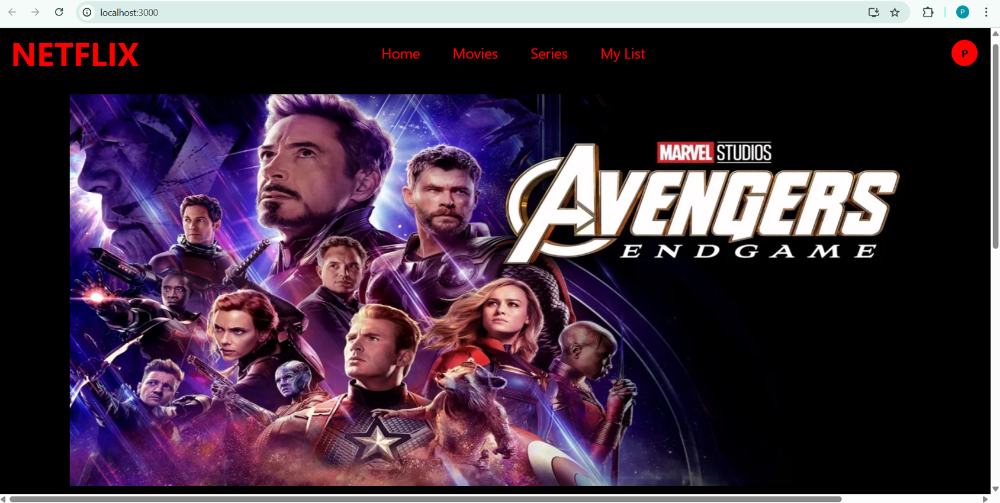
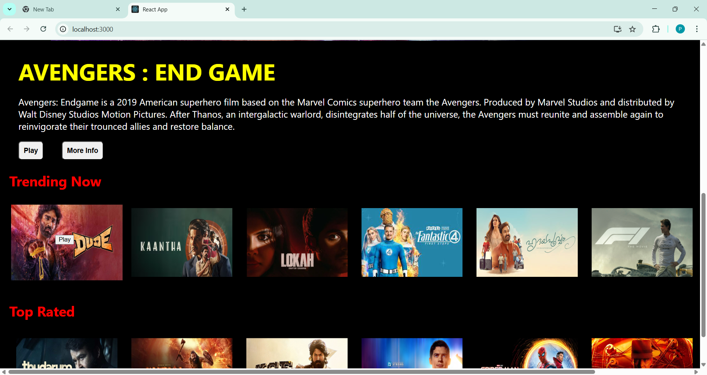

# Netflix-LIKE MOVIE WEBSITE (React.js)

A Netflix-style user interface built using React.js to demonstrate responsive layout design and component-based frontend development.

## Features
- Netflix-style homepage layout
- Movie cards UI
- Responsive design
- Reusable React components
- Clean UI styling

  
  
